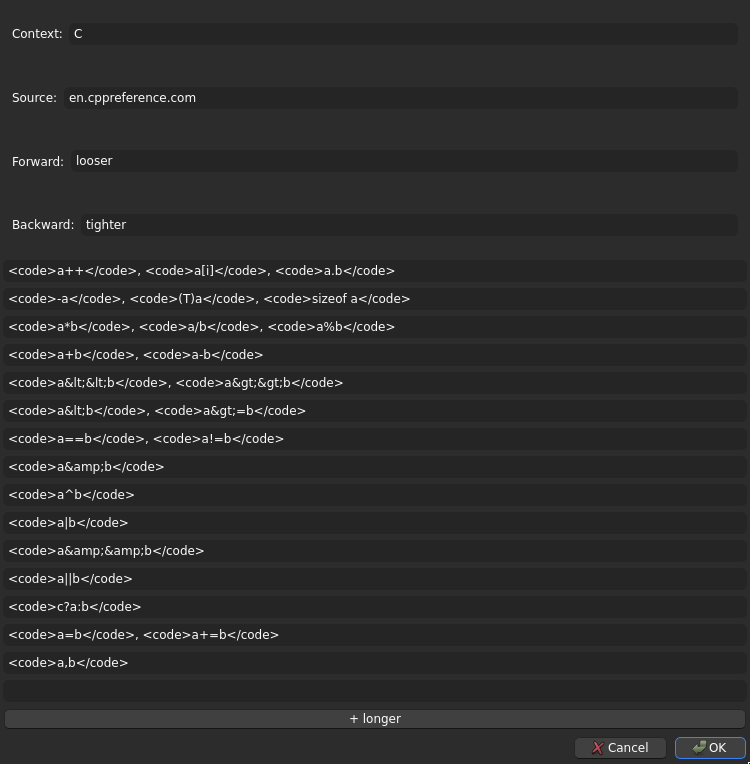

# Linearithmic toset
This is an Anki add-on to help you memorise sequences by their order, without trying to recall the items themselves.
"Linearithmic" describes the quantities of cards.
"Toset" describes the structure of the sequences.
See Theory for details on both.

## Problem
Suppose you got sick of parentheses and type errors, so you want to learn operator precedence in full.
Naively, to memorise a list like that, you might make associations (cards) from each item to the next.

> Q: `a.b`, `a[i]`, `a++`, next lower precedence?
>
> A: `-a`, `~a`, `(T)a`

> Q: `-a`, `~a`, `(T)a`, next lower precedence?
>
> A: `a*b`, `a/b`, `a%b`

> Q: `a*b`, `a/b`, `a%b`, next lower precedence?
>
> A: `a+b`, `a-b`

It's easy enough to make cards like in bulk, such as with Yukogurafu.
But if you study like this, you run into some trouble.

In practice, you'll see from context whatever items have to care about.
You write code and can already see that you're using (say) `&`, `==`, `<<`, and `+` operators.
Explicitly memorising what the items in the list are, as the answers to your cards, is a waste of effort.

If you never use `^`, which is between `&` and `|`, you'll tend to forget that `^` follows `&` and that `|` follows `^`.
That makes your knowledge of important items fragile, dependent on their position relative to unimportant items.

If you switch to another version of the list that inserts or removes entries, you'll repeatedly mess up when reviewing the card that goes over that stretched gap.
JavaScript introduces `a**b` between `-a` and `a*b`.
If you then go back to your cards designed for C that ask about `-a` and `a*b`, you'll fail the card when you recall `a**b`.
Or vice versa: you program in C, then come back to JavaScript cards, and forget `a**b`.
In either case, you may still know correctly that the order of operations is `-a`, `a**b`, then `a*b`.
But the cards won't show that.

None of this is unique to operator precedence.
| The list is ... | ... but what you need to know is ... | ... and you might or might not include |
|-----------------|--------------------------------------|---------------------------------------|
| `a++`, `-a`, `a*b`, `a+b` | which of a pair binds more tightly? | `a**b` |
| Birch Ave, Maple Rd, Oak St | should you go E or W? | Spruce Alley |
| registers, CPU cache, RAM, disk | which is faster? | NVRAM |

## Theory
An ordered list is a toset: a set of objects under a [total order]( https://en.wikipedia.org/wiki/Total_order ).
Look past the objects, and what remains is a comparison operator: a decision of which item comes first, given any two items.
If what you need to know is the order, what you should study is the set of those decisions.
Each question shows two items, and the answer you recall is how they compare.

> Q: `-a`, `~a`, `(T)a` to `a+b`, `a-b`, which way?
>
> A: lower precedence

> Q: `|` to `a < b`, `a >= b`, which way?
>
> A: higher precedence

You can improve on the approach from before by naively learning all $n (n - 1)$ such decisions between $n$ items.
But that number of cards is $O(n^2)$ or, colloquially, too much.

That figure assumes you compare each item to each other item.
Instead, compare each item to surrounding items at exponentially-increasing distances.
For each item, make a card to compare it to each item at distance 1, 2, 4, 8, etc, going in both directions until either end of the list.

E.g. from item 6 on a list of 15, you make cards that compare it to items preceding it by 1, 2, and 4 steps, and to items following it by 1, 2, 4, and 8 steps.
In total, those targets are items 2, 4, 5, 7, 8, 10, and 14.

That strategy gives $2 (k + 1) n - 2^(k+2) + 2$ cards for $n$ elements with $k = \lfloor \log_2{n} \rfloor$, which is linearithmic ( $O(n \log{n})$ ) to the number of elements, and more manageable.
E.g. 10 items produce 50 cards with this approach, and 15 items produce 90 cards.
The naive way would respectively give 90 and 210 cards.

Despite less thorough coverage, such cards should still suffice.
You'll learn to put items close together in the right order, and you'll learn connections in the order between distant items, to help tie the whole list together.

In Anki, we systematically make cards with [note types]( https://docs.ankiweb.net/getting-started.html#note-types ), so this add-on introduces note types `Sequence Ordering [n]` for various $n$.
They're added procedurally from the add-on's GUI.

## Setup
Install it from AnkiWeb, when I post it there.
Until then, download the ZIP and install it manually with Anki's menu:
```sh
# you downloaded linearithmic-toset-master.zip
unzip linearithmic-toset-master.zip
cd linearithmic-toset-master
# GitHub wraps a directory layer in ZIPs, which Anki needs not
zip linearithmic_toset.zip *
# Anki -> top menu -> Tools -> Add-ons -> Install from file... -> find that zip you just made
```

If needed, restart Anki.
If it still doesn't work, raise an issue here with the error message and/or faulty behaviour.

## Usage
Most features of linearithmic-toset are concentrated in "Edit Sequence Ordering", in the Tools menu at the top.
That menu entry launches a GUI.
If you start it with the note browser open, it will operate on whichever note is focused in the browser.
Otherwise, it will make and operate on a new note, its cards to go in the current deck.

Labelled text-boxes near the top edit four special fields.
- `Context` is text that appears in the front side of every card from the note (to indicate the topic and disambiguate terms)
- `Source` won't appear on the cards (I use it to describe why I learned the list)
- `Forward` describes the relation from items early in the list (as stored in the note) towards items late in the list (e.g. "lower-precedence", "east", "larger and slower"), to be shown in card answers
- `Backward` serves the same role in the other direction (e.g. "higher-precedence", "west", "smaller and faster")

Other, unlabelled text-boxes hold items of the list.
The list starts with 4 boxes to match 4 `Item` fields in the underlying note.
You can expand how much the note supports, and add text-boxes to match, with the "+ longer" button at the bottom.
This keeps existing items intact.



When you're done, click OK.
The toset note follows the exponential-gap rule (see Theory) automatically and in full to pick comparisons for which to produce cards.
The front of each card shows "**Context** Item A **→** Item B".
The back shows your note's customised `Forward` if A-to-B goes forward in the list (A before B), or the note's `Backward` if A-to-B goes backward.

After you make toset notes, you can edit them almost as easily from the built-in browser.

Edits to items already in a list update the text shown on all cards involving those items.

Edits that add new items (or make `Item` fields non-blank) lead to new cards.

Edits that set items blank will make cards that use those items go blank.
Finish the job with "Empty Cards..." in the Tools menu.
Deletions from either end are well-behaved.
Deletions from the middle unbalance the intended spacing between items compared across the new gap.
